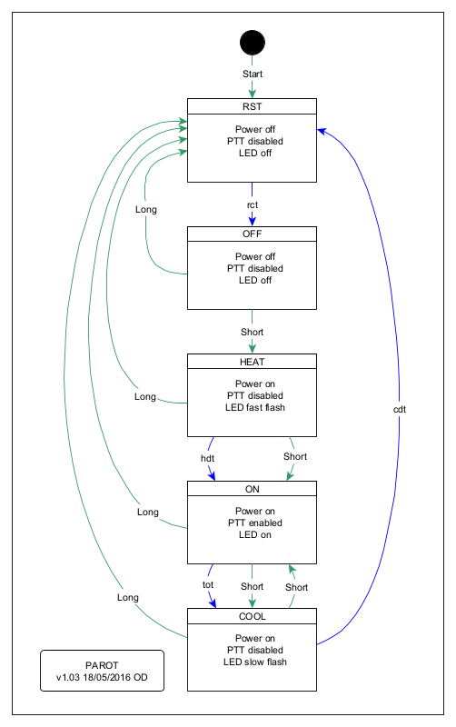

# Power Amplifier Run On Timer (PAROT) v2

Valve power amplifiers should not be put into 'transmit' mode until the cathode is at sufficient temperature, especially for coated cathode tubes (most commonly used on indirectly heated cathodes), as damage to the cathode surface can occur It can take from just a few seconds to five minutes or more for the cathode to reach suitable temperature.

Many valves benefit after full power operation from a cool down time to facilitate removal of heat energy from the PA enclosure before shut down of the cooling fan, and accordingly this feature is included in some amplifiers. For example the Kenwood TL-922 has a 140s cool down timer after filament is shut down and the service manual claims it will measurably extend tube life. Note that during PAROT's cool down phase, filaments / heaters are still powered and a longer cool down period is appropriate.

A common design for valve low end RF Power Amplifiers is that they are entirely powered from a single transformer, and often the cooling fan is dependent on that transformer. Again, low PAs often lack some form of protection against drawing current from a low temperature cathode.

Another flaw of some of these low end designs is that the mains fuses are inclined to blow if the power is cycled rapidly, just due to the residual heat in the fuses as a result of prior operation at high power, or possibly exacerbated by a soft start system that may be slow in recycling.

This article describes a simple external device to:

- disable the PTT control line for a timed period to ensure that the cathode is up to working temperature;
- a timed period for cool down of the PA; and
- an enforced minimum off time before the power can be cycled back on.

The device is inserted in the mains power connection between power outlet and amplifier, and between the transceiver's tx control line (referred to as PTT in this article) and PA's tx control. No alteration to the power amplifier is required, it is operated as normal except its power switch is left in the ON position and PAROT used exclusively for switch on / switch off.

# Logical design
The design uses a small microcontroller to interpret presses of a single button to operate a mains switching relay, a PTT relay and a LED for system status indication.

The system lends itself to a simple Finite State Machine design. Fig 1 shows the updated state diagram, Long and Short mean long and short button presses respectively, and rct, hdt and tot are three programmable timers. (Diagram produced with Lucidchart.)

The most common sequence of states would be from power on which starts at the RST state, automatically moving to the OFF state after RCT (typically 2s) and awaiting button input. A short button press moves the state to HEAT which powers the PA and after hdt (say 180s for an indirectly heated ceramic valve) moves to ON which enables PTT so the amplifier can be put into transmit mode. When operations are complete, a short press of the button moves the system to COOL state which blocks PTT and after a programmed cool down time (say 900s) moves to RST which after rct moves to OFF where it waits again for button input.

At any point, a long button push does an instant shutdown and moves to the RST state, then after rct to the OFF state waiting for input.

A cool down can be aborted and status returned to ON status at any time during the COOL state. Similarly, during the HEAT state, a short (or long) push will abort the start up and moves to the RST state, then after rct to the OFF state waiting for input.

If a short mains interruption occurs, the PAROT should reset (so long as its power supply filters don't hold too much charge) and start in the RST state to enforce a minimum power off time before moving to the OFF state where a short button press can reapply power to the PA.

Key to the logical design is separation of algorithms and operating parameters. Key operating parameters are stored in EEPROM and are field programmable to adapt the system to specific needs. The program is stored in flash memory.

# EEPROM

Above is the EEPROM map. Field ckadj is not used in PAROT v2.

The repository contains some example EEPROM configurations.

## Edit EEPROM image

If you do not have a suitable tool for editing the EEPROM binary image, this <a href="https://hexed.it/" target="_blank">online hex editor</a> might be useful.

# Inputs / Outputs

PAROT is controlled by on momentary switch to ground, BUTTON in the code.

PAROT has three outputs:

- LED to signal operating mode;
- PWR to operate a relay / SSR for the main power to the equipment; and
- PTT to operate a relay / opto coupler / Photomos to enable PTT pass through from transceiver to PA.

# Fuses

Example avrdude commands to configure fuses. These set BOD, do not use 5V BOD settings on a 3V target... it might not be easy to fix it.

## ATTiny25 5V

avrdude -P usb -c avrisp2 -p t25 -U lfuse:w:0x62:m -U hfuse:w:0xd4:m -U efuse:w:0xff:m

## ATTiny412 5V

avrdude -c serialupdi -p t412 -P $(PORT) -b 115200 -e -v -x rtsdtr=low -Ufuse0:w:0x00:m -Ufuse1:w:0b11100101:m -Ufuse2:w:0x02:m -Ufuse5:w:0b11000101:m -Ufuse6:w:0x04:m

## AtTiny1614 5V

avrdude -c serialupdi -p t1614 -P $(PORT) -b 115200 -e -v -x rtsdtr=low -Ufuse0:w:0x00:m -Ufuse1:w:0b11100101:m -Ufuse2:w:0x02:m -Ufuse5:w:0b11000101:m -Ufuse6:w:0x04:m

# Implementations tested

The following variants have been built and tested substantially:
- conventional DC power supply and 230VAC relay with 12VDC coil and miniature DIL 5V relay for PTT control;
- transformerless DC power supply and 230VAC relay with 230VAC coil driven by triac and opto isolator for PTT control; and
- transformerless DC power supply and 230VAC SSR with 3-24VDC control.

These were all constructed initially using PAROT v1, and were upgraded to v2 simply by updating the firmware (same EEPROM image used).

Today, I would consider a Photomos to control PTT, and possibly in place of the triac above. The SSR is protected by a 430V MOV.

